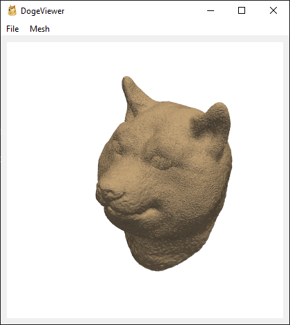

# PyVistaQt Standalone Application

Create a standalone 3D viewer application with [PyVistaQt](https://qtdocs.pyvista.org).

This repository provides a template for creating a Windows executable (`.exe`) of a
standalone PyVistaQt application.

## Features

- Bundle assets into the executable
- Create custom menus and actions
- Automated building on CI

## Automatied Building

The GitHub Actions workflow here will build the Windows installable executable and upload as an artifact to the workflow run.
